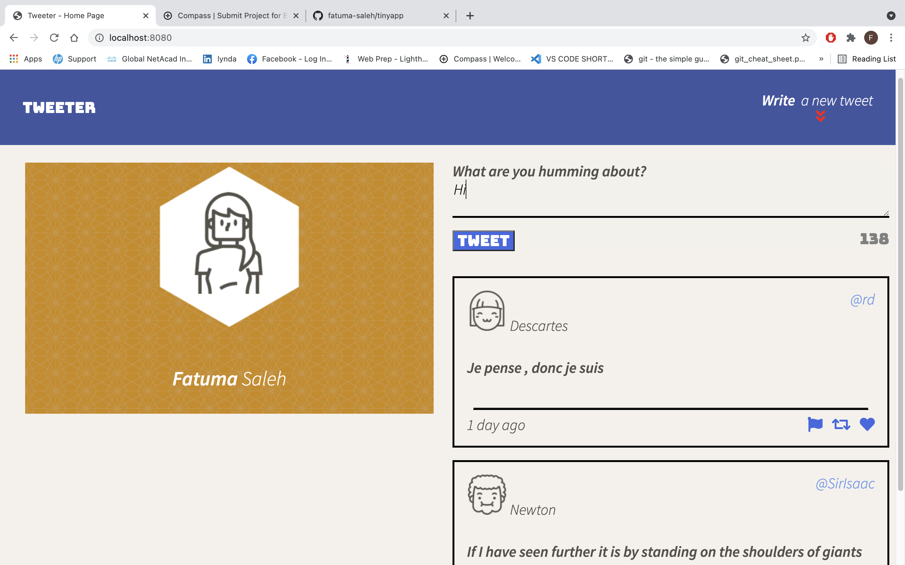
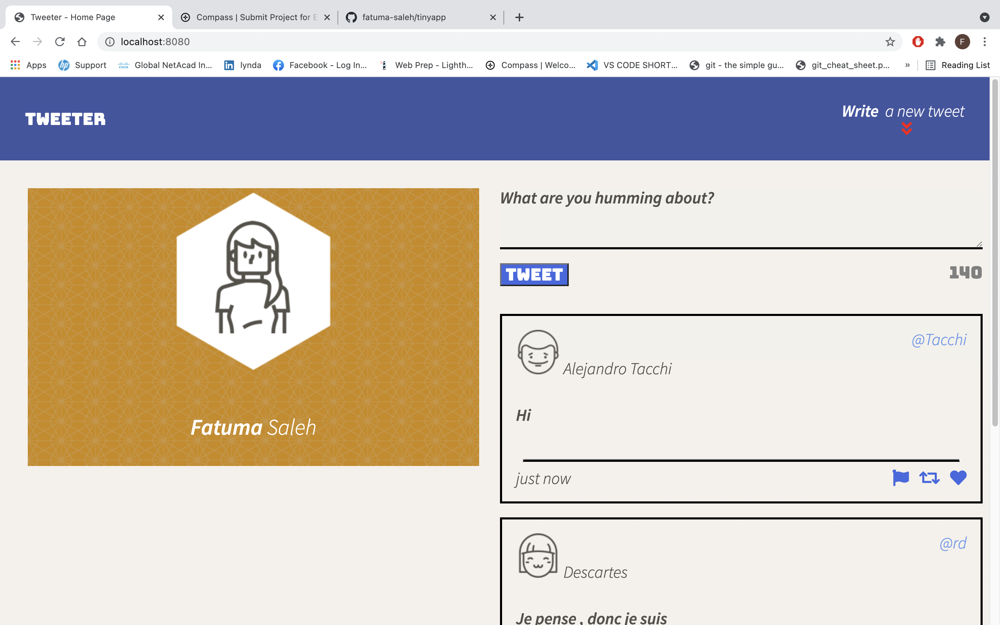
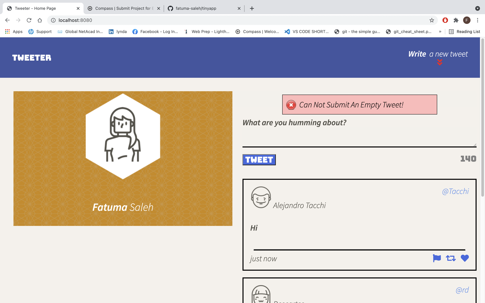

# Tweeter Project

Tweeter is a simple single-page,AJAX-based Twitter clone that uses jQuery,HTML5 and plain CSS .

## Getting Started

1. Install all dependencies using the `npm install` command.
2. Start the web server using the `npm run local` command. The app will be served at <http://localhost:8080/>.
3. Go to <http://localhost:8080/> in your browser.

## Dependencies

- Node.js
- Express
- Body-parser
- Chance

## Final Product

